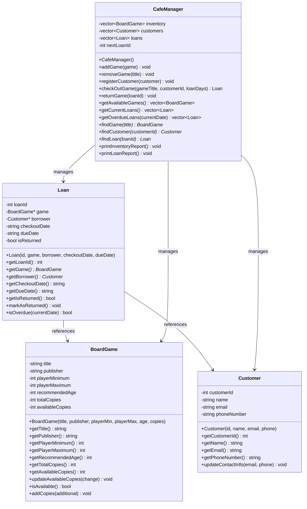

# Board Game Café Management System Design

## 1. Program Specification

The Board Game Café Management System is a lightweight application designed to track the café's board game inventory and lending operations. The system maintains a database of all board games owned by the café, including their availability status. It allows staff to check out games to customers, record due dates, monitor current loans, and process returns. The program provides simple reporting features to view game availability and current borrower information to efficiently manage the café's lending service.

## 2. Nouns and Verbs Analysis

### Nouns (Potential Classes/Attributes)
- **BoardGame**: The physical games in the café's collection
- **Customer**: People who borrow games
- **Loan**: The transaction of lending a game
- **Inventory**: The collection of all board games
- **LoanManager**: System to manage the lending process
- **Copy**: Individual copy of a board game title

### Verbs (Potential Methods)
- **addGame**: Add a new game to the inventory
- **removeGame**: Remove a game from the inventory
- **checkOutGame**: Lend a game to a customer
- **returnGame**: Process a returned game
- **getAvailableGames**: List all games that are currently available
- **getLoanedGames**: List all games that are currently checked out
- **searchGame**: Find a specific game in the inventory
- **registerCustomer**: Add a new customer to the system
- **generateReport**: Create a summary of inventory and loans

## 3. Class Designs

### BoardGame Class
```cpp
class BoardGame {
private:
    std::string title;
    std::string publisher;
    int playerMinimum;
    int playerMaximum;
    int recommendedAge;
    int totalCopies;
    int availableCopies;
    
public:
    BoardGame(std::string title, std::string publisher, int playerMin, int playerMax, int age, int copies);
    
    std::string getTitle() const;
    std::string getPublisher() const;
    int getPlayerMinimum() const;
    int getPlayerMaximum() const;
    int getRecommendedAge() const;
    int getTotalCopies() const;
    int getAvailableCopies() const;
    
    void updateAvailableCopies(int change);
    bool isAvailable() const;
    void addCopies(int additional);
};
```

### Customer Class
```cpp
class Customer {
private:
    int customerId;
    std::string name;
    std::string email;
    std::string phoneNumber;
    
public:
    Customer(int id, std::string name, std::string email, std::string phone);
    
    int getCustomerId() const;
    std::string getName() const;
    std::string getEmail() const;
    std::string getPhoneNumber() const;
    
    void updateContactInfo(std::string email, std::string phone);
};
```

### Loan Class
```cpp
class Loan {
private:
    int loanId;
    BoardGame* game;
    Customer* borrower;
    std::string checkoutDate;
    std::string dueDate;
    bool isReturned;
    
public:
    Loan(int id, BoardGame* game, Customer* borrower, std::string checkoutDate, std::string dueDate);
    
    int getLoanId() const;
    BoardGame* getGame() const;
    Customer* getBorrower() const;
    std::string getCheckoutDate() const;
    std::string getDueDate() const;
    bool getIsReturned() const;
    
    void markAsReturned();
    bool isOverdue(std::string currentDate) const;
};
```

### CafeManager Class
```cpp
class CafeManager {
private:
    std::vector<BoardGame> inventory;
    std::vector<Customer> customers;
    std::vector<Loan> loans;
    int nextLoanId;
    
public:
    CafeManager();
    
    void addGame(const BoardGame& game);
    void removeGame(const std::string& title);
    void registerCustomer(const Customer& customer);
    
    Loan checkOutGame(const std::string& gameTitle, int customerId, int loanDays);
    void returnGame(int loanId);
    
    std::vector<BoardGame> getAvailableGames() const;
    std::vector<Loan> getCurrentLoans() const;
    std::vector<Loan> getOverdueLoans(const std::string& currentDate) const;
    
    BoardGame* findGame(const std::string& title);
    Customer* findCustomer(int customerId);
    Loan* findLoan(int loanId);
    
    void printInventoryReport() const;
    void printLoanReport() const;
};
```

## 4. Class Diagram

