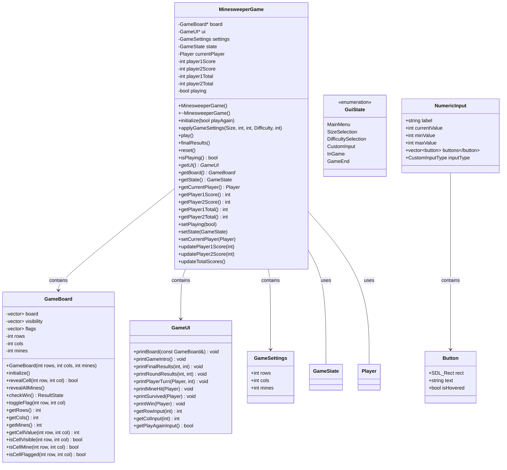
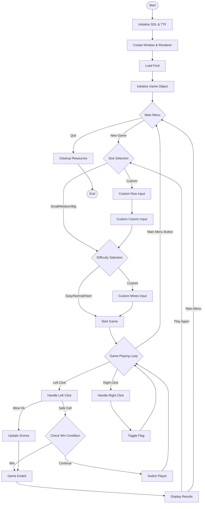
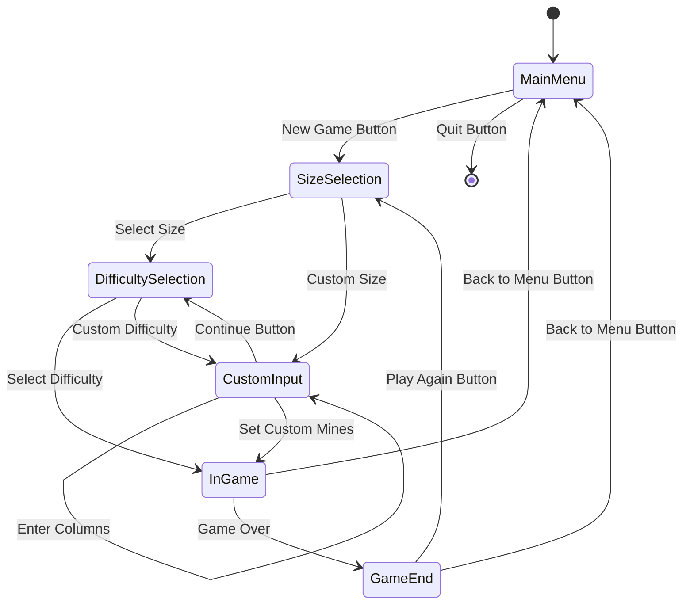

# Minesweeper Duel System Design
A two-player adaptation of the classic Minesweeper game featuring a graphical interface built with SDL2.
## 1. Program Specification

Minesweeper Duel is a two-player adaptation of the classic Minesweeper game featuring a graphical interface (SDL2).
Players alternate turns to reveal or flag cells on a rectangular grid. Revealing a safe cell yields +1 point; 
uncovering a mine incurs –2 points and grants +2 points to the opponent. 
Clearing all non-mine cells ends the round with a +3 bonus to the round winner. 
Cumulative scores persist across multiple rounds.games owned by the café, including their availability status. 
It allows staff to check out games to customers, record due dates, monitor current loans, and process returns. 
The program provides simple reporting features to view game availability and current borrower information to efficiently manage the café's lending service.

### Main features:
- Configurable grid size and mine count (preset difficulties or custom)Turn-based scoring and point-tracking for both players
- Mouse-driven UI: left-click to reveal, right-click to flag
- Round reset and final result display

## 2. Nouns and Verbs Analysis

### Nouns (Potential Classes/Attributes)
- **Cell**: Represents a single square (mine, adjacent count, visibility, flag)
- **GameBoard**: 2D grid of Cell objects plus mine layout
- **Player**: Holds name/ID, current round score, total score
- **MinesweeperGame**: Orchestrates rounds, turn order, and scoring
- **GameSettings**: Stores rows, cols, mineCount, difficulty presets
- **GameUI**: Handles input/output via SDL2 (render board, dialogs)

### Verbs (Potential Methods)
- **initializeBoard**: Place mines, compute adjacent counts
- **revealCell(row,col)**: Reveal cell; cascade zeros
- **toggleFlag(row,col)**: Mark/unmark flags
- **checkRoundEnd()**: Determine win/lose/continue
- **switchPlayer()**: Alternate active player
- **updateScore(player, points)**: Adjust scores
- **resetRound(playAgain)**: Clear board, reset round scores
- **render()**: Draw grid and UI elements
- **handleClick(x,y,button)**: Map mouse to game action

## 3. Class Designs

### Cell Class
```cpp
class Cell {
private:
    bool hasMine;
    int adjacentMines;
    bool isRevealed;
    bool isFlagged;
public:
    Cell();
    bool reveal();            
    void toggleFlag();
    int getAdjacentMines() const;
    bool containsMine() const;
    bool revealed() const;
    bool flagged() const;
};
```

### GameBoard Class
```cpp
class GameBoard {
private:
    std::vector<std::vector<Cell>> grid;
    int rows, cols, mineCount;
public:
    GameBoard(int r, int c, int mines);
    void initialize();                      
    bool revealCell(int row, int col);
    void toggleFlag(int row, int col);
    bool isCleared() const;               
    Cell& getCell(int row, int col);
};
```

### Player Class
```cpp
class Player {
private:
    std::string name;
    int roundScore;
    int totalScore;
public:
    Player(const std::string& n);
    void addPoints(int pts);
    void resetRoundScore();
    int getRoundScore() const;
    int getTotalScore() const;
};
```

### MinesweeperGame Class
```cpp
class MinesweeperGame {
private:
    GameBoard board;
    GameUI ui;
    Player player1, player2;
    Player* currentPlayer;
    GameSettings settings;
public:
    MinesweeperGame(const GameSettings& s);
    void start();                           
    void processMove(int row, int col, bool flagMode);
    void switchPlayer();
    void endRound();                        
};
```
### GameUI Class
```cpp
class GameUI {
public:
    void renderBoard(const GameBoard& board);
    void displayScores(int p1, int p2);
    std::tuple<int,int,bool> getPlayerAction(); // returns row, col, flag?
    bool promptPlayAgain();
};
```


## 4. Class Diagram




## 5. Game Flow Diagram





## GUI State Transition


